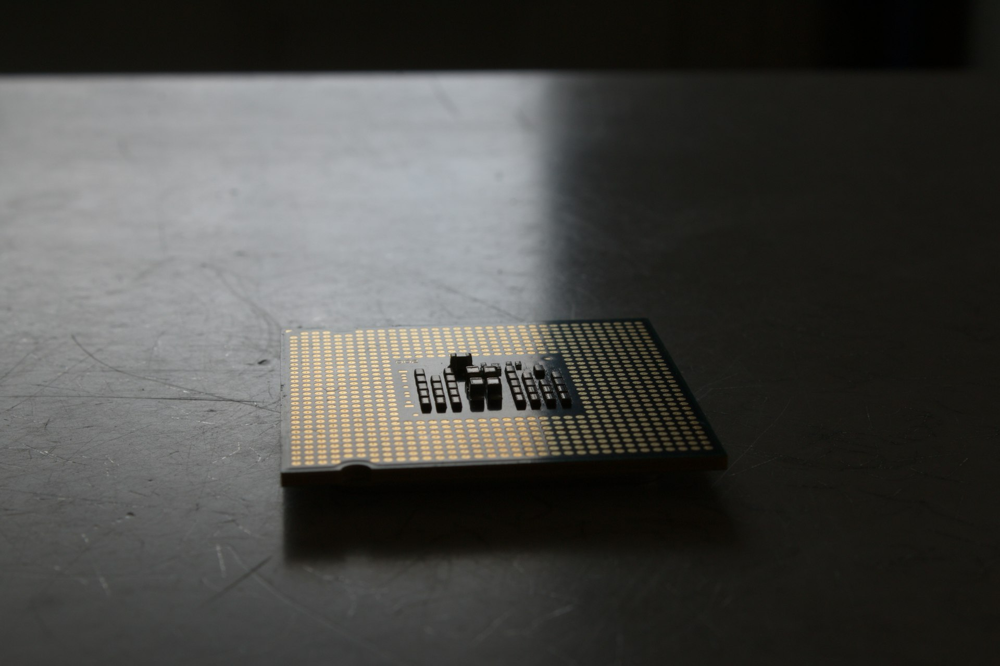
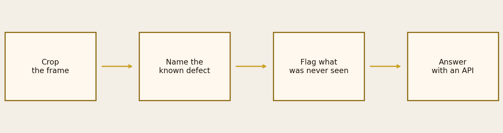
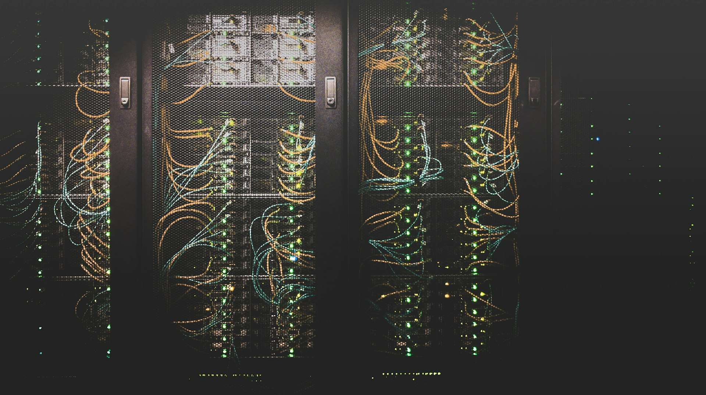

<!-- _class: cover -->
<!-- _paginate: false -->

# Can a camera scrap
# fewer good parts
# without letting
# unknowns through?

Machine learning · Industry / quality control

Valeo · Challenge Data ENS #157

---

<!-- _class: split -->

# This is quality
# control on Valeo
# component photos.

Eight thousand images. Six defects have names.
The seventh — the unknown — appears only at test time.

**The deliverable: a decision rule, then an API.**

---

<!-- _class: split -->

# A good part labelled
# “unknown” is the
# expensive mistake.

On an electronics line, a false reject is not a rounding error.

**Valeo prices it ten thousand times higher than a mix-up between two known defects.**

---

<!-- _class: split -->

# Who has a call
# to make.

Valeo quality: keep the camera, not halt the line.

The operator: scrap, pass, or open the bin.

**The challenge jury: score that same cost logic.**

---

<!-- _class: full -->

# The camera does not
# see “the board”.
# It sees a window.

We crop. We name what is known.
We flag what has never been seen.

---

<!-- _class: chart -->

Four steps, not a single “brain”.

---

<!-- _class: dark -->

# This project is not.

Not a leaderboard hunt.

Not an HR dashboard.

**A pipeline: photo → decision → API.**

---

<!-- _class: full -->

# Zero good parts
# labelled unknown.

The threshold protects GOOD.
Twenty false alarms. None on a healthy part.

---

<!-- _class: chart -->

The notebook scraps 13 good parts. The chosen threshold scraps none.

---

<!-- _class: split -->

# This is not
# a homemade metric.

The cost grid comes from Valeo’s challenge.

The 13 is the official model, not ours.

---

<!-- _class: actions -->

# Monday.

**Quality** — keep the threshold that protects GOOD.

**Ops** — billing alarm before any cloud spend.

Not a magic model. A rule you can defend.

---

<!-- _class: cta -->

# Your turn.

[All four decks](https://dimiphoton.github.io/valeo-quality-control-with-computer-vision/)

[Source code](https://github.com/dimiphoton/valeo-quality-control-with-computer-vision)
