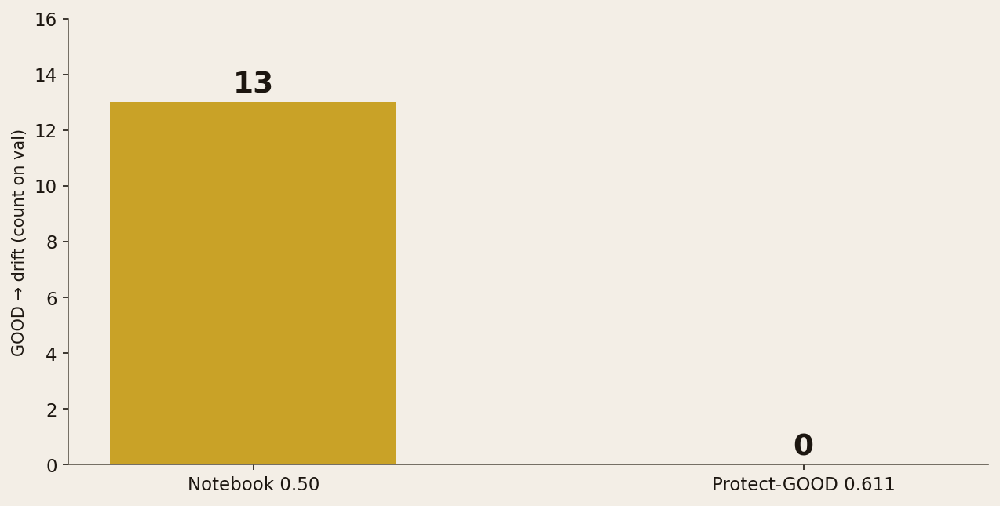
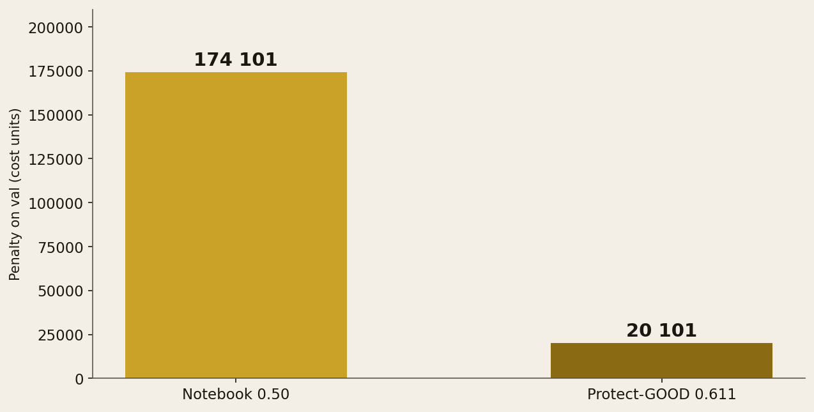

<!-- _class: cover -->
<!-- _paginate: false -->

# Une caméra peut-elle
# jeter moins de pièces
# saines — sans laisser
# passer l'inconnu ?

Machine learning · Industrie / contrôle qualité

Valeo · Challenge Data ENS #157

---

<!-- _class: split -->

# Une pièce saine
# classée « inconnue »
# coûte très cher.

Sur une ligne électronique, le faux rebut n'est pas un détail.

**Le brief Valeo le chiffre : dix mille fois plus qu'un défaut mal nommé.**

---

<!-- _class: split -->

# Qui a une décision
# à prendre.

Qualité Valeo : tenir la caméra, pas tout arrêter.

L'opérateur : jeter, laisser passer, ou ouvrir.

**Le jury du challenge : scorer la même logique de coût.**

---

<!-- _class: full -->

# La caméra ne voit
# pas « la carte ».
# Elle voit une fenêtre.

On recadre. Six défauts ont un nom.
Le septième — le drift — n'existe pas à l'entraînement.

---

<!-- _class: split -->

# Comment on lit
# les photos.

8 278 images train. Six libellés.
Une classe, « Missing », écrase tout le reste.

**Le drift n'apparaît que sur le test caché.**
On calibre donc sans jamais l'avoir vu.

---

<!-- _class: dark -->

# Ce projet, ce n'est pas.

Pas une chasse au classement.

Pas un tableau de bord RH.

**Une règle de décision, puis une API d'inférence.**

---

<!-- _class: full -->

# 99,8 % de bonnes
# étiquettes.
# Ce n'est pas le sujet.

Au seuil du notebook : 13 pièces saines
jetées comme inconnues.

---

<!-- _class: full -->

# Zéro pièce saine
# classée inconnue.

Seuil choisi pour protéger le GOOD.
Vingt fausses alertes. Aucune sur une pièce bonne.

---

<!-- _class: chart -->

Le notebook jette 13 pièces saines. Le seuil retenu, zéro.

---

<!-- _class: chart -->

Sur le jeu de contrôle, la facture tombe de 174 000 à 20 000.

---

<!-- _class: split -->

# Ce n'est pas
# un artefact maison.

La grille de coût vient du challenge Valeo.

Le 13, c'est le modèle officiel, pas le nôtre.

---

<!-- _class: actions -->

# Lundi.

**Qualité** — garder le seuil qui protège le GOOD.

**Ops** — alarme de facturation avant tout cloud.

Pas un modèle magique. Une règle qu'on peut défendre.

---

<!-- _class: cta -->

# À vous.

[Code source](https://github.com/dimiphoton/valeo-quality-control-with-computer-vision)

[Challenge Valeo](https://challengedata.ens.fr/participants/challenges/157/)
