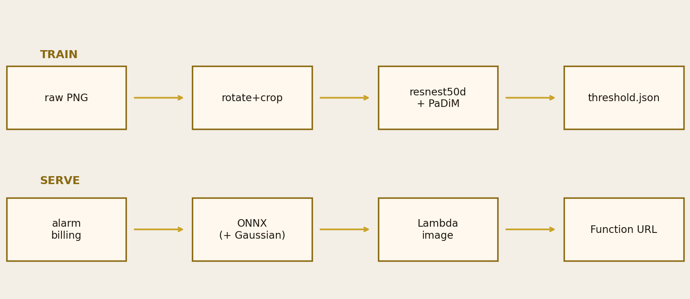
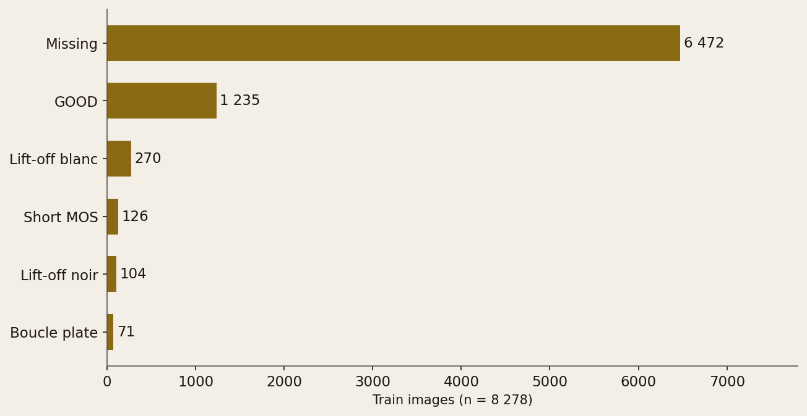
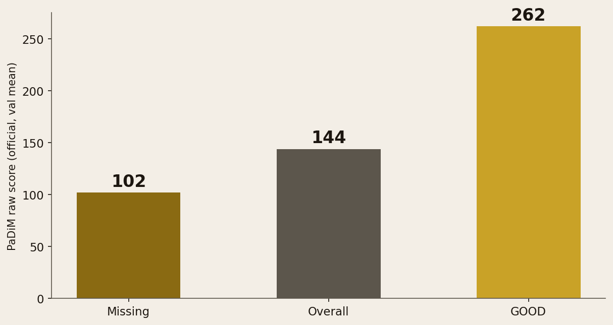
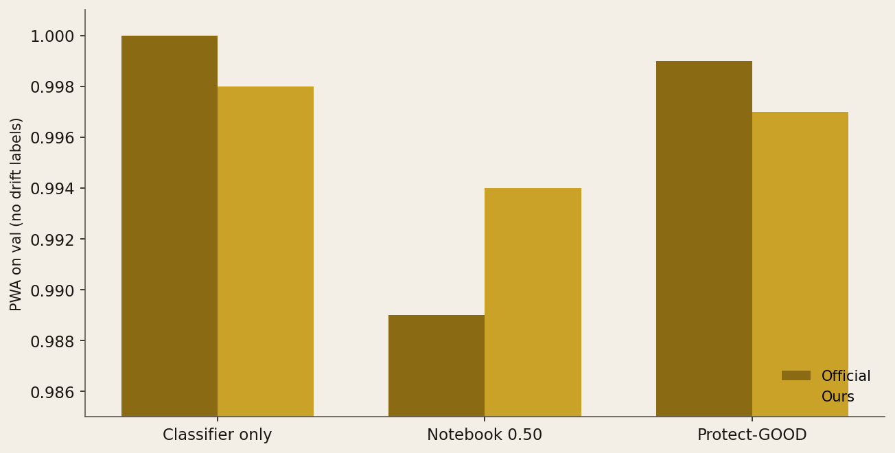

<!-- _class: cover -->
<!-- _paginate: false -->

# From crop to Lambda:
# name known defects,
# flag drift,
# at business cost.

Machine learning · Industry / quality control · Python / PyTorch / ONNX / AWS

Valeo · ENS #157 · 8,278 training images

---

<!-- _class: split -->

# We reproduce the
# official pipeline,
# then we serve it.

Valeo challenge: six named defects, drift absent from train.
Fusion is fitted on the cost matrix, not on accuracy.

**Ship: `threshold.json` + an ONNX API, no PyTorch.**

---

<!-- _class: split -->

# GOOD → drift
# costs 10,000.

A known defect given the wrong name: 1.
A GOOD part thrown as unknown: 10,000.

**With no drift labels on val, maximising PWA turns PaDiM off.**

---

<!-- _class: split -->

# Who consumes
# the score.

The jury: PWA on a hidden test (2 submissions / 24 h).

Plant quality: POST an image, get a class.

**The notebook is not the product. The API is.**

---

<!-- _class: full -->

# Two models,
# one decision.

resnest50d: six known defects.
PaDiM (WRN-50-2): distance to the training cloud.
Above the threshold → drift.

---

<!-- _class: chart -->

Train on one path, inference on the other. Billing alarm before Lambda.

---

<!-- _class: split -->

# Grain: one image,
# two resolutions.

Raw PNG → rotate + crop by `lib`.
224 px classifier, 128 px PaDiM.

**In production the PaDiM min-max is frozen.
Per-image min-max would always score 1.**

---

<!-- _class: split -->

# What we isolate.

We strip out the confounder “max PWA on a val set with no drift”.

What remains: the lowest threshold that never maps GOOD to drift.

Not an AUC. Not a global F1.

---

<!-- _class: dark -->

# Scope.

Honest benchmark, ONNX export, CloudFormation plan.

No leaderboard chase, no anomalib, no SAM.

---

<!-- _class: chart -->

Missing is 6,472 images. *Boucle plate* is 71. Headline accuracy lies.

---

<!-- _class: full -->

# The official pickle
# is 99.8 % / F1 0.973.

Our resnest50d: 99.5 % / 0.960.
*Boucle plate* stays the weak spot (recall 0.86).

---

<!-- _class: chart -->

PaDiM is not fitted on healthy parts. Missing is more in-distribution than GOOD.

---

<!-- _class: full -->

# Protect-GOOD = 0.611.
# PWA 0.999. 0 GOOD flagged.

Val n = 1,655, zero drift labels.
Twenty false drifts, none of them GOOD.

---

<!-- _class: chart -->

At 0.50 the official run pays for 13 GOOD. The chosen threshold cuts that cell. Ours follows.

---

<!-- _class: dark -->

# Where it breaks.

Hidden test labels — no local score on drift.

PaDiM Gaussian: 1.2 GB pickle, off Lambda by default.

Public Function URL; `--apply` never hit a real account.

---

<!-- _class: cta -->

# Reproduce.

[github.com/dimiphoton/valeo-quality-control-with-computer-vision](https://github.com/dimiphoton/valeo-quality-control-with-computer-vision)

`python -m valeo_qc.cli predict image.png`

`python -m valeo_qc.cli deploy --email you@example.com`

   
