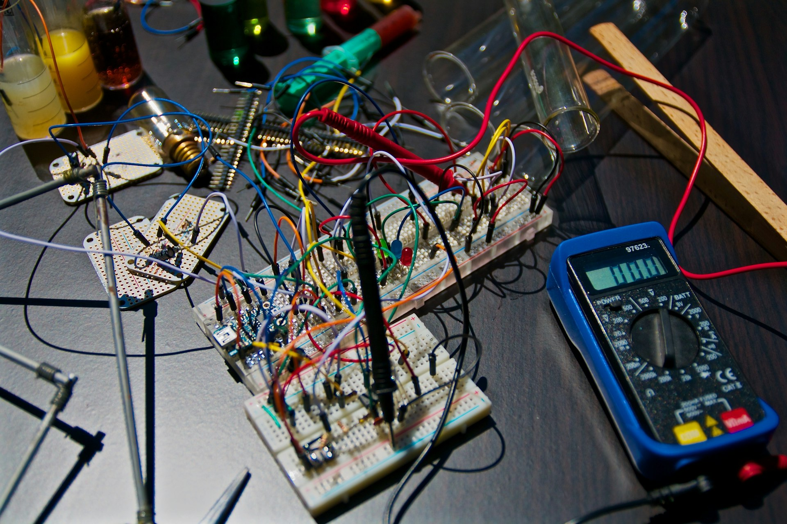

<!-- _class: cover -->
<!-- _paginate: false -->

# Comment fusionner
# classifieur et PaDiM
# quand le val n'a pas
# de drift ?

Machine learning · Industrie / contrôle qualité · Python / PyTorch / ONNX / AWS

Valeo · ENS #157 · 8 278 images train

---

<!-- _class: split -->

# GOOD → drift
# coûte 10 000.

Un défaut connu mal nommé : 1.
Un GOOD jeté comme inconnu : 10 000.

**Sans labels drift au val, maximiser la PWA éteint PaDiM.**

---

<!-- _class: split -->

# Qui consomme
# le score.

Le jury : PWA sur un test caché (2 soumissions / 24 h).

Qualité usine : une API, image in, classe out.

**Le livrable n'est pas un notebook. C'est un seuil exporté.**

---

<!-- _class: full -->

# Deux modèles,
# une décision.

resnest50d : six défauts connus.
PaDiM (WRN-50-2) : distance au nuage d'entraînement.
Au-dessus du seuil → drift.

---

<!-- _class: split -->

# Grain et
# unités.

PNG brut → rotate + crop selon `lib`.
224 px classifieur, 128 px PaDiM.

**On ne mélange pas le min-max du batch val
avec une image unique en prod.**

---

<!-- _class: split -->

# Ce qu'on isole.

On retire le confondant « max PWA sur un val sans drift ».

Ce qui reste : le plus petit seuil qui ne classe aucun GOOD en drift.

Pas un AUC. Pas un F1 global.

---

<!-- _class: dark -->

# Périmètre.

On fait un benchmark honnête, puis une API ONNX.

On n'est pas un leaderboard, ni anomalib, ni SAM.

---

<!-- _class: chart -->

Missing pèse 6 472 images. Boucle plate, 71. L'accuracy globale ment.

---

<!-- _class: full -->

# Le pickle officiel
# fait 99,8 % / F1 0,973.

Notre resnest50d : 99,5 % / 0,960.
Boucle plate reste le point faible (rappel 0,86).

---

<!-- _class: chart -->

PaDiM n'est pas calé sur les pièces saines. Missing est plus « in-distribution » que GOOD.

---

<!-- _class: full -->

# Protège-GOOD = 0,611.
# PWA 0,999. 0 GOOD flaggé.

Val n = 1 655, zéro label drift.
Vingt faux drift, aucun GOOD.

---

<!-- _class: chart -->

À 0,50 l'officiel paye 13 GOOD. Le seuil retenu coupe cette case. Le nôtre suit.

---

<!-- _class: split -->

# Même logique
# sur le réentraînement.

Officiel à 0,50 : 13 GOOD.
Nous à 0,50 : 3 GOOD.
Protège-GOOD : 0 des deux côtés.

---

<!-- _class: dark -->

# Pourquoi pas le max PWA.

Il met le seuil à 1 et éteint PaDiM.

Pourquoi pas un transformer : le pickle officiel est un ResNeSt-50d.
On compare à ce qu'il y a, pas à un autre sujet.

---

<!-- _class: dark -->

# Où ça casse.

Labels test cachés — pas de score local sur le drift.

Gaussienne PaDiM : pickle 1,2 Go, hors Lambda par défaut.

Function URL publique, `--apply` jamais lancé sur un compte.

---

<!-- _class: cta -->

# Reproduire.

[github.com/dimiphoton/valeo-quality-control-with-computer-vision](https://github.com/dimiphoton/valeo-quality-control-with-computer-vision)

`python -m valeo_qc.cli predict image.png`

`python -m valeo_qc.cli deploy --email toi@exemple.fr`

   
